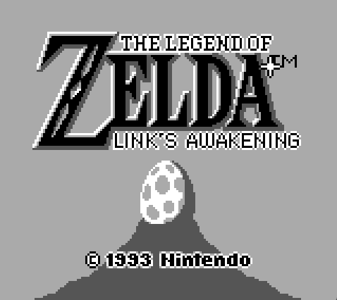
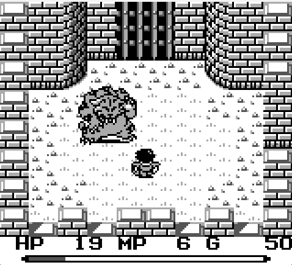

# gamuboy-rs
A Game Boy emulation core written in Rust

 
 

## Example emulators using this library

- [gamuboy-rs-gui](https://github.com/axelmln/gamuboy-rs-gui)

## Motivation

Learning about emulation and rust

## Usage

Add to your `Cargo.toml`:

```toml
gamuboy = { git = "https://github.com/your-username/gamuboy" }
```

### *Example*

```rust
use gamuboy::{
    config::Config,
    gameboy::GameBoy,
    lcd::{LCD, FrameBuffer},
    stereo::StereoPlayer,
    joypad::Joypad,
    joypad_events_handler::{self},
    saver::GameSave,
};

struct Gui {}

impl LCD for Gui {
    fn draw_buffer(&mut self, matrix: &FrameBuffer) {
        // your draw logic
    }
}

struct Stereo {}

impl StereoPlayer for Stereo {
    fn play(&self, buffer: &[f32]) {
        // your sound playing logic
    }
}

struct EventsHandler {}

impl joypad_events_handler::EventsHandler<Event> for EventsHandler {
    fn handle_events(&mut self, rx: &Receiver<sdl2::event::Event>, joypad: &mut Joypad) {
        let joypad_events: Vec<_> = rx.try_iter().collect();
        // handle events with your key bindings
        // exemple:
        for evt in joypad_events {
            match evt {
                Event::KeyDown { code: Some(key), ... } => {
                    match key {
                        Keys::Up => joypad.update(joypad::Button::Up, true), // mutate gamuboy Joypad state
                        // ...
                    }
                },
                // ...
            }
        }
    }
}

struct FileSaver {}

impl GameSave for FileSaver {
    fn set_title(&mut self, title: String) {
        // handle what to do with the game identifier
    }

    fn load(&self) -> Result<Vec<u8>, Error> {
        // handle save state loading
    }

    fn save(&self, ram: &[u8]) -> Result<(), Error> {
        // handle state saving
    }
}

fn main() {
    let cfg = Config {
        rom: load_rom(), // load a rom file
        headless_mode: false,
        bootrom: load_bootrom(), // optionally load a bootrom (boot sequence is skipped if not provided)
        log_file_path: None,
    };

    let (event_tx, event_rx) = std::sync::mpsc::channel::<Event>(); // init an event channel to send joyoad events

    let mut gb = GameBoy::new(
        &cfg,
        Gui::new(), // inject your LCD implementation
        Stereo::new(), // inject your sound implementation
        EventsHandler::new(), // Inject your joypad event handler implementation, where your key bindings happen
        FileSaver::new(), // Inject your game saver implementation
        &event_rx, // inject event receiver
    );

    let my_event_poller = EventPoller::new(); // init your event poller

    loop {
        for event in my_event_poller.poll() {
            event_tx.send(event).unwrap(); // handle event polling as you need before sending it via the event channel
        }

        gb.step(); // advance the gameboy state
    }
}
```


## 🚧 Status

### Working
- CPU
- PPU
- APU
- Interrupts
- Joypad
- Timer
- MBC 1, 2 and 5
- Game saves


### Test suite

#### Blargg's test roms [https://github.com/retrio/gb-test-roms]

**Every dmg** tests except:
- [ ] oam_bug
- [ ] halt_bug

#### Mooneye test suite [https://github.com/Gekkio/mooneye-test-suite]

Tested and working:
- [x] MBC1 tests
- [x] MBC2 tests
- [x] MBC5 tests


### Todo
- [ ] Support other MBCs
- [ ] Color support
- [ ] Serial

